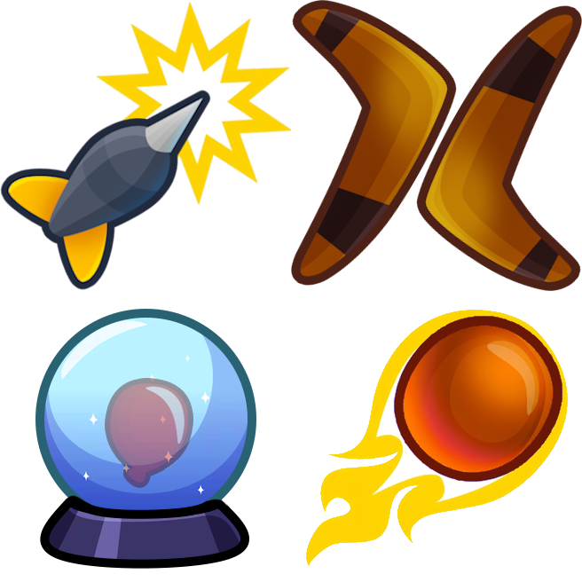
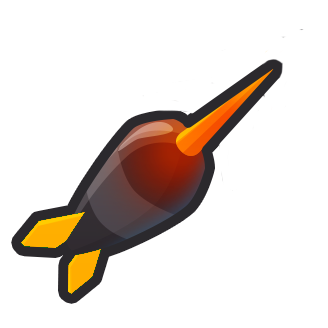
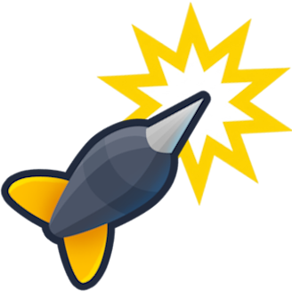
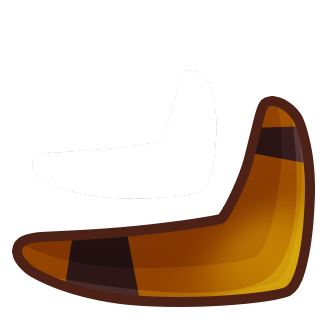
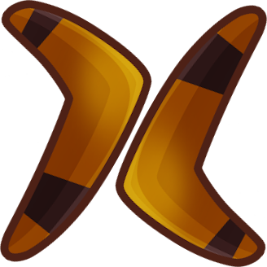
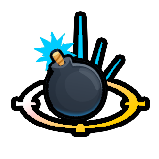
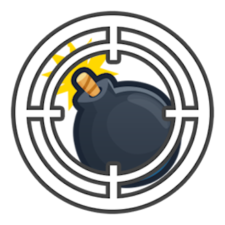
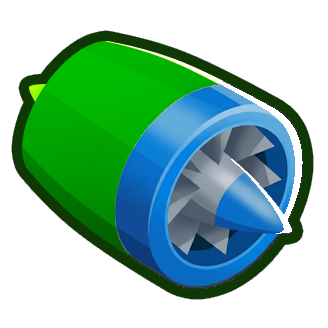
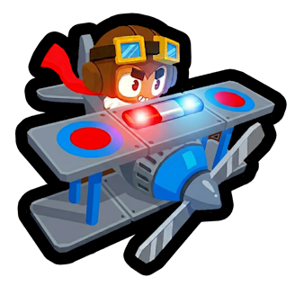

<h1 align="center">

Mini Crosspaths
</h1>

Adds a number of mini two-upgrade Paths++ paths for towers. 

Many are based on old BTD game features / my favorite features that I've implemented in other mods such as Mega Knowledge or Rogue Remix, others are brand new.
This makes them available in a balanced way in regular games, making you pay a fair price and consider the crosspathing tradeoffs
(unless you have Paths++ Balanced Mode turned off).

<!--Start-->

## Splodey Dart Monkeys Path

#### 1. Heat Tipped Darts ($125)

Heat tipped darts allow the Dart Monkey to pop Frozen and Lead Bloons.

#### 2. Splodey Darts ($400)

Projectiles will create a small explosion the first time they collide with a Bloon.

Explosions have the same pierce as the projectile, and the same base damage (but unaffected by damage modifiers).

## Double Ranga Boomers Path

#### 1. Sonic Boom ($100)

Boomerangs can smash through Frozen Bloons for extra damage.

All projectiles can pop Frozen bloons, gaining a damage bonus equal to the projectile's base damage.

#### 2. Double Ranga ($400)

Throws 2 Boomerangs at a time, but not as frequently.

Main boomerangs, MOAB Press Boomerangs, and orbiting glaives have double projectile count but two thirds attack speed.

## Laser Rang Boomers Path

#### 1. Laser Rangs ($250)

Now throws Laser-Rangs, gaining increased pierce and projectile speed.

Projectiles can longer pop Purple Bloons, but travel 25% faster and have pierce increased by +4 or x1.5, whichever is higher, with MOAB press getting a flat +60.

#### 2. Plasma Rangs ($350)

Upgrades to Plasma-Rangs, attacking even faster.

Can pop Frozen and Lead Bloons. Fire rate for all weapons is 50% faster, including Glaive-Lord orbital damage.

## Instant Bomb Shooters Path

#### 1. Quantum Payload ($150)

Bombs explode instantly at the target's location with no travel time.

#### 2. Precision Munition ($500)

Can hit Bloons it can see anywhere on screen. Attacks 30% slower for very far away Bloons.

Gains global effective range. If Bloons are further than twice the original displayed range, attacks 30% slower.

## Dreadnought Boats Path

#### 1. Dreadnought ($600)

Shoots molten cannonballs instead of darts/grapes that deal extra damage and can pop all Bloon types.

Projectiles can hit all Bloon types, and their base damage and additive bonuses are all increased by +1 or x1.3, whichever is higher.

#### 2. Privateer ($800)

Earns 50% more cash from Bloons popped / hooked. Merchantman income is increased by 10%.

Cash from Bloons is 1.5x, Merchantman income is +10% after other additive bonuses like Trade Empire.

## Hover Plane Aces Path

#### 1. Hover Plane ($600)

Now longer flies in paths, instead hovering wherever you direct it.

Replaces all default movement with Heli Pilot style movement.

#### 2. Pursuit ($500)

A new targeting option enables Monkey Ace to seek and pursue the Bloons automatically.

Gains the Pursuit targeting option like Heli Pilots.

## Crystal Ball Wizards Path

#### 1. Monkey Apprentice ($75)

Further study makes all Wizard projectiles travel much further.

All projectiles that travel in a straight line have doubled lifespan.

#### 2. Crystal Ball ($1,000)

Gains a toggle to allow long range targeting of Bloons in radius of your other towers. Loses Guided Magic's obstacle ignoring behavior while active.

Toggle Advanced Intel style targeting at the cost of giving up Guided Magic ignoring blockers, if you have it. Projectiles will always use Guided Magic homing to hit targets.

<!--End-->

